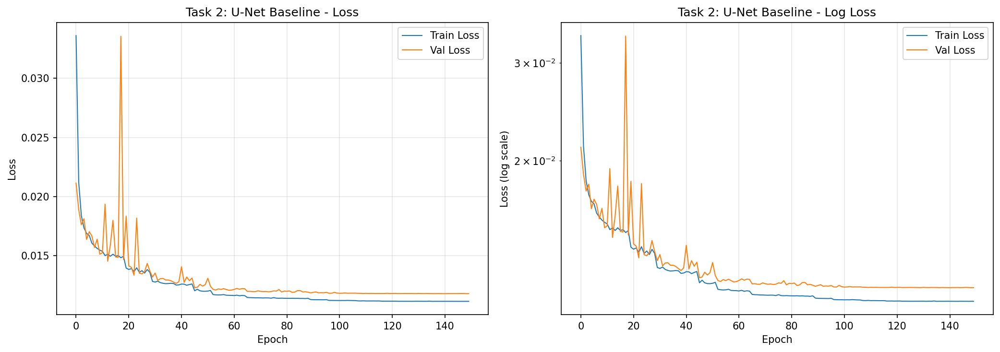
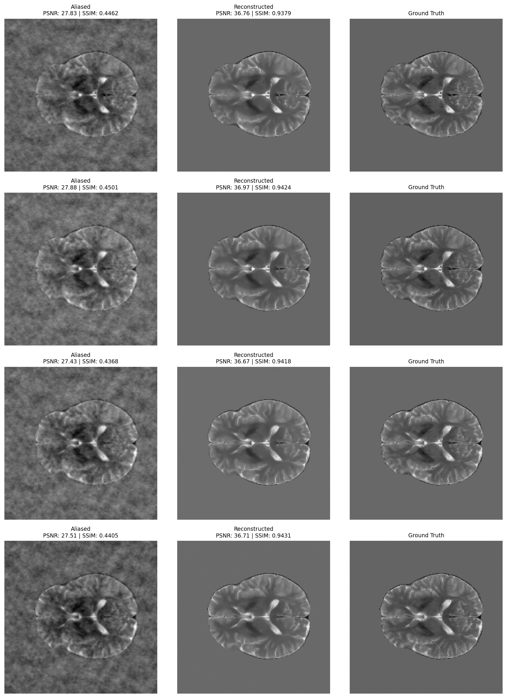
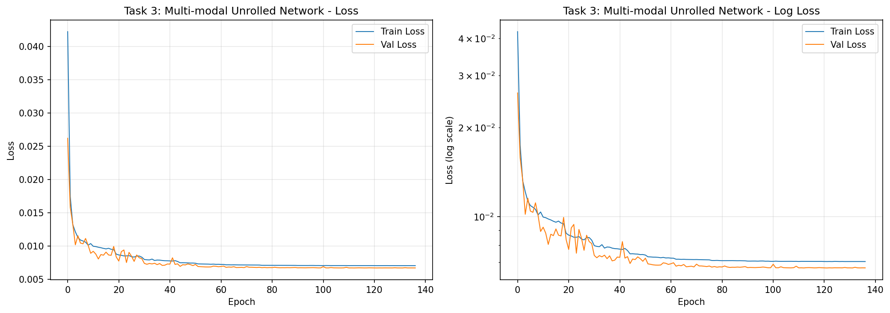
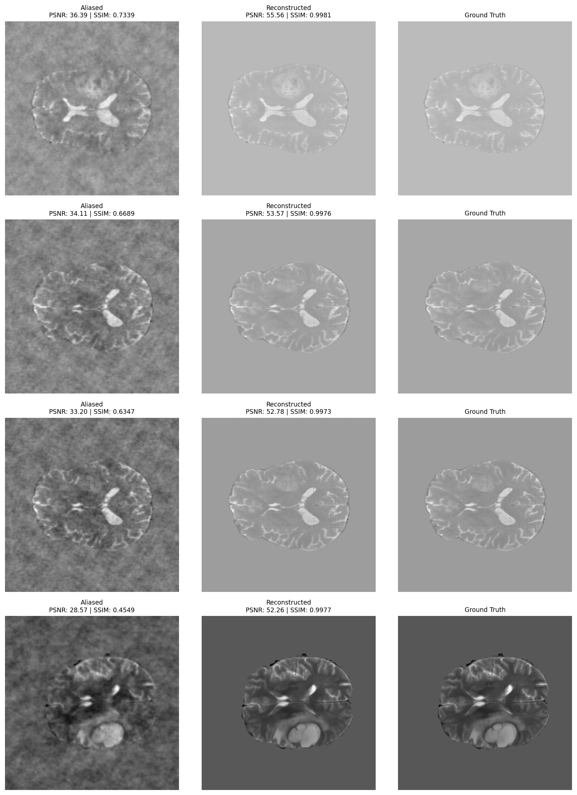
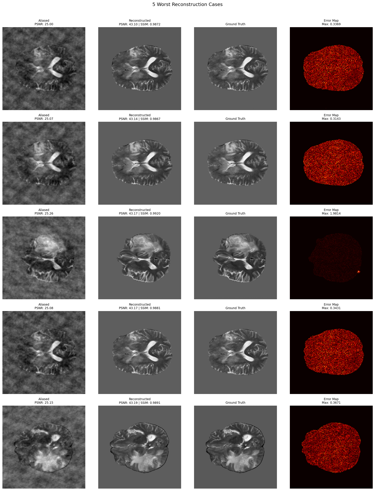

# BraTS MRI Reconstruction Project

Generated from config `config/formal_train.yaml` on 2026-04-28 15:11:13.

## Group Information

- Course: BME AI Project 1
- Group: 第4组
- Chinese names: 唐志昊 2022533131
- Note: This report was generated from the final verified experiment outputs and then reviewed before submission.

## AI Usage Declaration

AI tools were used only as development assistance for code debugging, experiment orchestration, and draft editing. All implementation decisions, experimental validation, result interpretation, and final submitted materials were manually reviewed and confirmed by the student before submission.

Presentation reminder: AI assistance is explicitly declared in the generated presentation slides, in accordance with the assignment requirement.

## Project Objective

This project reconstructs fully sampled T2 brain MRI slices from AF=5 undersampled k-space using the BraTS dataset. The work is organized into three assignment tasks: undersampling simulation, a baseline deep reconstruction model, and a multi-modal unrolled reconstruction model with data consistency.

## Dataset and Preprocessing

- Dataset path: `../bmeaidataset`
- Modalities used: T1, T2
- Slice axis: 2
- Intensity normalization: z-score on non-zero voxels
- Split strategy: patient-level train/validation/test
- Slice selection for this run: 16 central slices per patient
- Volume loading mode: preloaded in RAM to reduce I/O stalls
- Split counts: train=6992, validation=1504, test=1504
- Data split unit: patient-level split to avoid leakage across adjacent slices from the same subject

## Methods

### Task 1

A 2D random variable-density sampling mask with acceleration factor 5 is generated in k-space. Fully sampled T2 slices are transformed with FFT, masked, and reconstructed with inverse FFT to obtain aliased images. This part establishes the artifact pattern that the learning-based models must remove.

### Task 2

Task 2 uses a U-Net baseline with base channels 24, depth 4, batch size 8, MSE loss, and learning rate 0.0005. `ReduceLROnPlateau` is used for learning rate decay.
To improve runtime efficiency on the available RTX 4060 laptop GPU, the training pipeline uses slice caching, pinned memory, non-blocking GPU transfers, `channels_last`, TF32, and prefetch-friendly dataloading to reduce GPU idle time.

### Task 3

Task 3 uses an unrolled U-Net with 2 cascades, data consistency layers, and multi-modal input consisting of aliased T2 plus fully sampled T1. The loss is `hybrid` with L1 weight 0.7.
The design motivation is that T1 provides stable anatomical structure, while the data-consistency layer constrains the network output to remain faithful to the measured undersampled k-space.

## Division of Labor

- 唐志昊：完成项目整合、训练实验执行、结果核查、报告整理与提交。

## Quantitative Results

- Task 2 improved PSNR from 25.76 dB to 35.18 dB and SSIM from 0.3628 to 0.9271.
- Task 3 improved PSNR from 25.76 dB to 38.12 dB and SSIM from 0.3628 to 0.9660.
- Compared with Task 2, Task 3 changed PSNR by 2.93 dB and SSIM by 0.0389.

## Figures and Tables

### Dataset Split Chart

### Metric Comparison Chart

### Summary Tables

## Dataset Split

| Split | Slice Count |
| --- | ---: |
| Train | 6992 |
| Validation | 1504 |
| Test | 1504 |

## Hyperparameters

| Setting | Task 2 | Task 3 |
| --- | --- | --- |
| Input | Aliased T2 | Aliased T2 + full T1 |
| Backbone | U-Net | Unrolled U-Net + DC |
| Base channels | 24 | 16 |
| Depth | 4 | 3 |
| Batch size | 8 | 4 |
| Epochs | 10 | 8 |
| Learning rate | 0.0005 | 0.0001 |
| Loss | MSE | hybrid |

## Quantitative Results

| Method | PSNR (dB) | SSIM |
| --- | ---: | ---: |
| Aliased input | 25.76 | 0.3628 |
| Task 2 baseline | 35.18 | 0.9271 |
| Task 3 multi-modal | 38.12 | 0.9660 |

## Improvements Over Aliased Input

| Method | PSNR Gain (dB) | SSIM Gain |
| --- | ---: | ---: |
| Task 2 baseline | 9.43 | 0.5643 |
| Task 3 multi-modal | 12.36 | 0.6032 |

## Task 3 Over Task 2

| Comparison | Value |
| --- | ---: |
| PSNR gain | 2.93 dB |
| SSIM gain | 0.0389 |

### Worst-case Table

| Rank | Patient | Slice | PSNR Before | PSNR After | SSIM Before | SSIM After |
| --- | --- | ---: | ---: | ---: | ---: | ---: |
| 1 | BraTS-GLI-00077-000 | 76 | 23.26 | 34.69 | 0.2865 | 0.9443 |
| 2 | BraTS-GLI-00077-000 | 82 | 23.14 | 34.74 | 0.2875 | 0.9502 |
| 3 | BraTS-GLI-00088-001 | 82 | 24.33 | 34.82 | 0.3160 | 0.9439 |
| 4 | BraTS-GLI-00077-000 | 78 | 23.23 | 34.82 | 0.2942 | 0.9481 |
| 5 | BraTS-GLI-00077-000 | 79 | 23.22 | 34.84 | 0.2921 | 0.9484 |

### Task 1 Visualization

### Task 2 Loss Curve

### Task 2 Reconstructions

### Task 3 Loss Curve

### Task 3 Best Reconstructions

### Task 3 Error Analysis

## Error Analysis

The 5 worst-performing Task 3 cases are summarized below. Even in these difficult slices, the reconstructed outputs still remain substantially better than the aliased inputs, which indicates that the failure mode is degradation in relative quality rather than complete reconstruction collapse.

| Rank | Patient | Slice | PSNR After | SSIM After |
| --- | --- | ---: | ---: | ---: |
| 1 | BraTS-GLI-00077-000 | 76 | 34.69 | 0.9443 |
| 2 | BraTS-GLI-00077-000 | 82 | 34.74 | 0.9502 |
| 3 | BraTS-GLI-00088-001 | 82 | 34.82 | 0.9439 |
| 4 | BraTS-GLI-00077-000 | 78 | 34.82 | 0.9481 |
| 5 | BraTS-GLI-00077-000 | 79 | 34.84 | 0.9484 |

Potential improvements for these cases include stronger edge-preserving loss terms, more cascades if runtime allows, and targeted inspection of slices with complex tumor boundaries.

## Execution Status

- Current run status: Success
- Output directory: `outputs_formal`
- Total runtime: 24m 42s
- Last completed stage: assets
- Log file: `outputs_formal/logs/formal_pipeline.log`

## Discussion

The final experiment used 16 central slices per patient across all available BraTS patients and achieved a stable improvement over the aliased baseline in both tasks.

The Task 2 baseline recovered most of the missing image fidelity, improving PSNR by 9.43 dB and SSIM by 0.5643, which confirms that the basic supervised reconstruction pipeline converged correctly.

Task 3 further improved PSNR by 12.36 dB and SSIM by 0.6032 over the aliased input, and outperformed Task 2 by 2.93 dB PSNR and 0.0389 SSIM.

These results support the intended project conclusion: adding fully sampled T1 structural guidance together with unrolled data-consistency reconstruction yields clearer edges, fewer residual artifacts, and better quantitative fidelity than a single-modality baseline.

The remaining difficult cases are concentrated in slices with more complex local structure, suggesting that future improvements could come from stronger edge-aware losses, a deeper unrolled design, or targeted sampling and training strategies for harder anatomical regions.

## Submission Checklist

- Code: prepared
- Report draft: `REPORT.md`
- LaTeX report: `REPORT.tex`
- PDF report: `REPORT.pdf`
- Presentation slides: generated as `slides.tex` and `slides.pdf`
